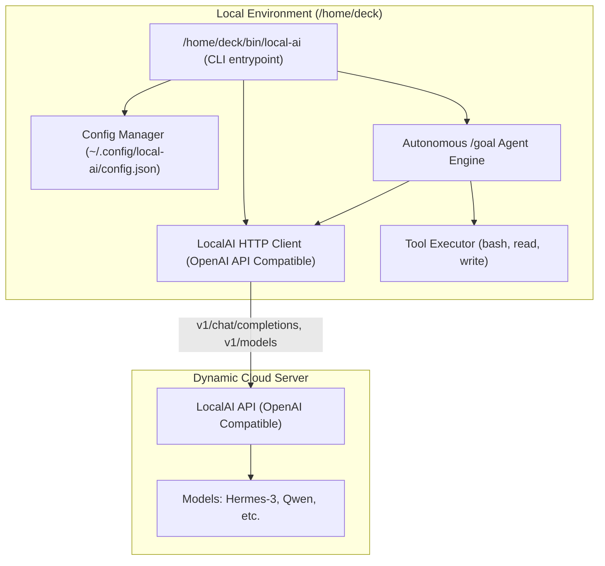

# Design Specification: LocalAI Remote Client CLI & Autonomous Goal Runner

**Date:** 2026-09-11  
**Status:** Approved for Implementation  
**Target Path:** `/home/deck/bin/local-ai`  
**Config Path:** `/home/deck/.config/local-ai/config.json`  

---

## 1. Overview & Objectives

This specification outlines the architecture and implementation of `local-ai`, a command-line interface and autonomous agent runner designed to connect to remote LocalAI instances running on dynamic cloud IPs (initially `http://94.130.18.206:8080`).

### Key Objectives
1. **Dynamic Host Resolution:** Simple and flexible configuration for remote instances whose IP addresses and ports change frequently.
2. **Fast Interactive & Single-Shot Interface:** Responsive streaming terminal chat (`local-ai chat`) and prompt runner (`local-ai run`).
3. **Autonomous `/goal` Mode (Zero Max Turn Limit):** Multi-turn autonomous agent execution loop with tool execution (`execute_command`, `read_file`, `write_file`) running indefinitely (`--max-turns 0`) until explicit goal completion (`<!-- GOAL_COMPLETE -->`).
4. **Reliability & Resilience:** Automatic retry on transient cloud network drops and clean diagnostic error messages.
5. **System Integration:** Executable installed at `/home/deck/bin/local-ai`, owned by user `deck:deck`.

---

## 2. Architecture & Components



### 2.1 Resolution Priority for Remote Host
The target URL is resolved dynamically in the following order:
1. `--url` / `-u` CLI flag (per-command override)
2. `LOCALAI_URL` or `OPENAI_BASE_URL` environment variables
3. Configuration file at `/home/deck/.config/local-ai/config.json`
4. Fallback default: `http://94.130.18.206:8080`

### 2.2 Configuration Schema
```json
{
  "url": "http://94.130.18.206:8080",
  "default_model": "Hermes-3-Llama-3.2-3B-Q4_K_M.gguf",
  "timeout": 60,
  "max_retries": 3
}
```

---

## 3. Command Line Interface Specification

### 3.1 Subcommands
* **`local-ai run "<prompt>"`**
  * Executes a single query and streams the completion response to `stdout`.
  * Supports piping standard input: `cat file.txt | local-ai run "summarize"`
  * Options: `--model <name>`, `--temperature <float>`, `--system "<prompt>"`.

* **`local-ai chat`**
  * Launches an interactive multi-turn REPL chat session.
  * Live token streaming in terminal.
  * In-chat slash commands:
    * `/help`: Display available commands.
    * `/models`: Query and list models from the remote endpoint.
    * `/model <name>`: Switch active model.
    * `/status`: Display endpoint URL, ping latency, and current model.
    * `/goal <task>`: Launch an autonomous goal execution loop from within chat.
    * `/clear`: Clear conversation context.
    * `/exit` or `/quit`: Exit chat.

* **`local-ai goal "<objective>"`**
  * Autonomous agent execution loop.
  * Default turns: `--max-turns 0` (no turn limit; runs indefinitely until goal completion or `Ctrl+C`).
  * `--autonomous` / `-y`: Automatically approve tool executions without per-turn confirmation.
  * `--model <name>`: Model to use for reasoning (defaults to configured model).
  * Completion criterion: Model emits `<!-- GOAL_COMPLETE -->`.

* **`local-ai config [set-url <url> | set-model <model> | show]`**
  * Update or display current configuration settings.
  * Example: `local-ai config set-url http://new-ip:8080`

* **`local-ai models`**
  * Fetch and list all available models registered on the remote LocalAI server.

* **`local-ai status` / `local-ai ping`**
  * Health check probing `/v1/models` and `/healthz` (if present), displaying ping round-trip time and model count.

---

## 4. `/goal` Autonomous Loop Details

### 4.1 System Prompt & Tool Calling
When `local-ai goal` is invoked, the agent initializes with an agentic system prompt and exposes three tools using the standard OpenAI function/tool calling schema:

1. `execute_command(command: str)`
   * Executes bash commands locally under user `deck`.
   * Returns stdout, stderr, and exit code.
2. `read_file(path: str)`
   * Reads and returns content of local files.
3. `write_file(path: str, content: str)`
   * Writes content to a file, ensuring correct user permissions.

### 4.2 Multi-Turn Execution Flow
1. User provides initial objective.
2. Agent loops:
   - Formulates thought and requests tool calls or produces text.
   - CLI prints thought and planned action.
   - If `--autonomous` is true (or user approves in step mode), tool is executed.
   - Tool output is appended to messages as `tool` response.
   - Request sent back to remote model.
3. Cycle continues without turn limit until:
   - Model response contains `<!-- GOAL_COMPLETE -->`.
   - User cancels with `Ctrl+C`.

---

## 5. Resilience & Error Handling

1. **Transient Network Hiccups:** Built-in HTTP retry with exponential backoff (1s, 2s, 4s) for connection resets or 5xx gateway errors.
2. **Host Unreachable:** If connection fails, output clear message indicating the dynamic IP might have changed, recommending:
   `local-ai config set-url http://<new-ip>:<new-port>`
3. **Signal Handling:** Graceful cleanup on `SIGINT` (Ctrl+C) and `SIGTERM`.

---

## 6. Testing & Verification Plan

1. **Unit & Functional Tests:**
   * Test config loading, priority override (flag > env > file).
   * Test argument parsing for all subcommands.
   * Test HTTP client request formatting and streaming parsing.
2. **Integration with Remote Instance (`94.130.18.206:8080`):**
   * Verify `local-ai status` against live server.
   * Verify `local-ai models` lists remote models.
   * Verify `local-ai run "echo 123"` streams completion.
   * Verify `local-ai goal "create a test file /tmp/local_ai_test.txt with content 'goal passed'"` completes autonomously and creates the file.
   * Verify `local-ai config set-url` correctly updates configuration.
